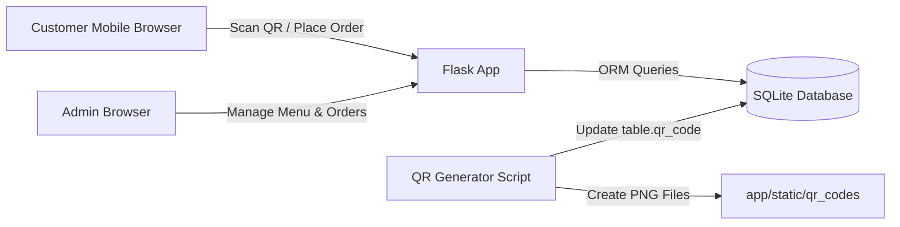
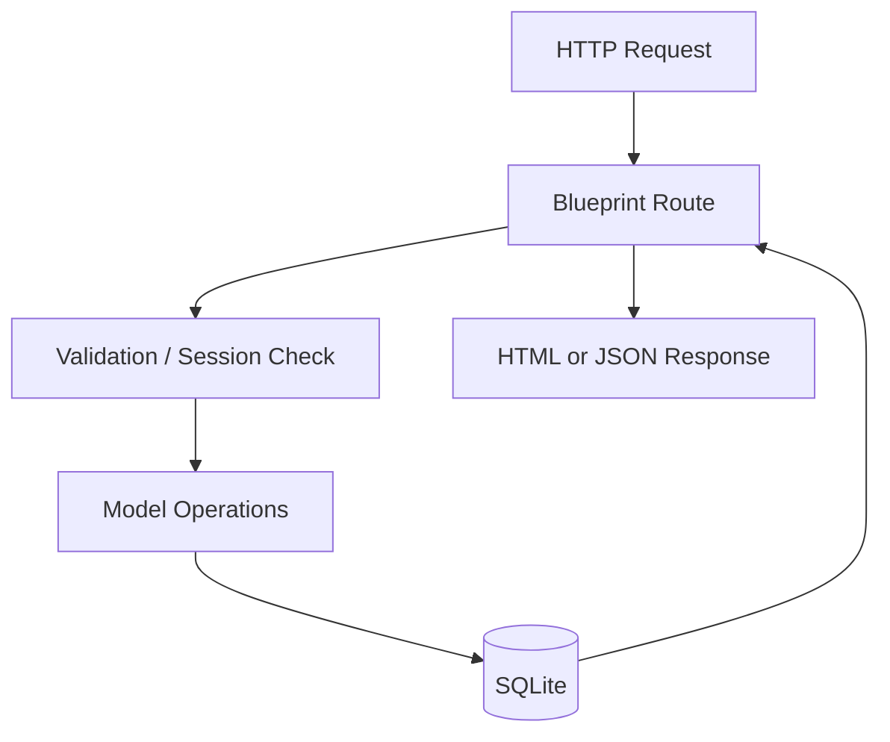
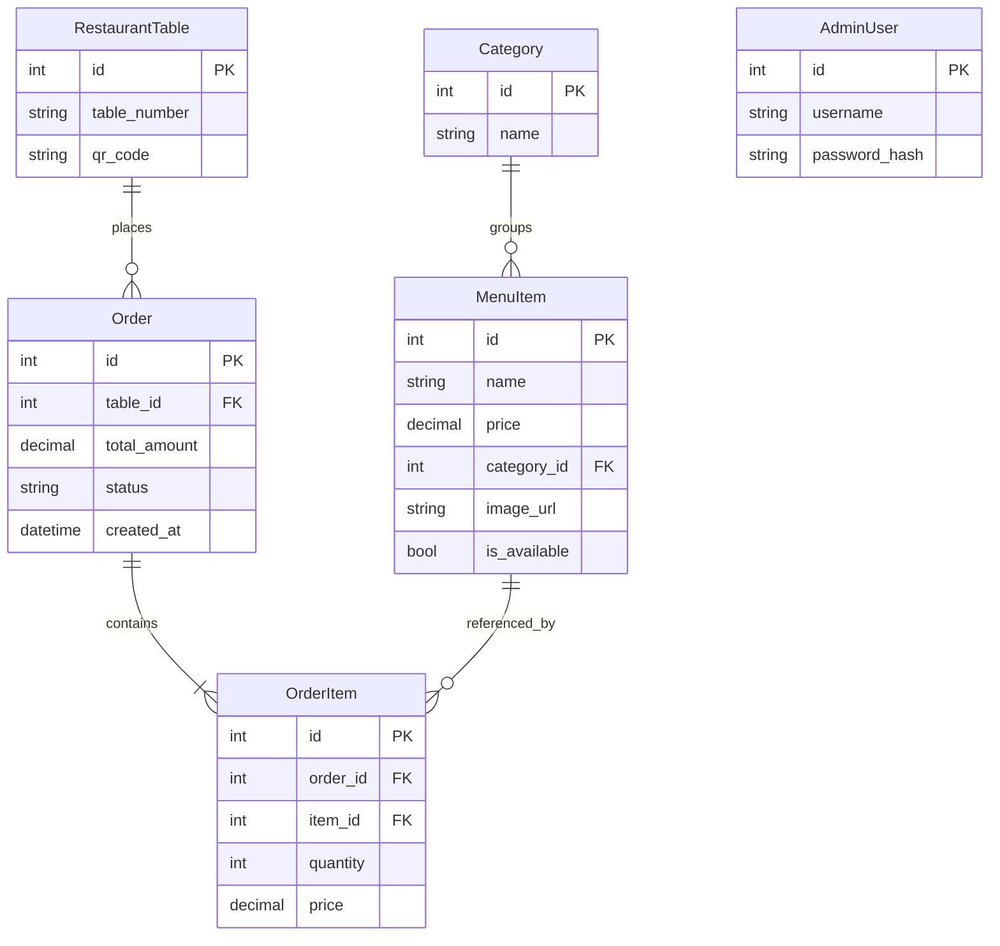
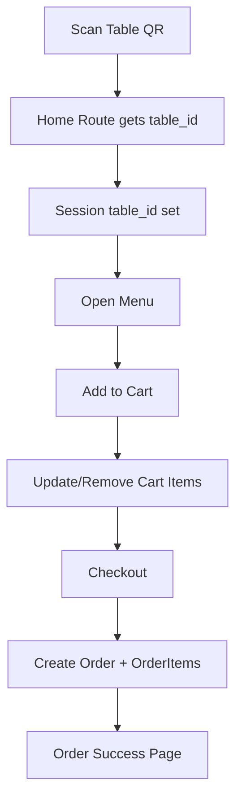
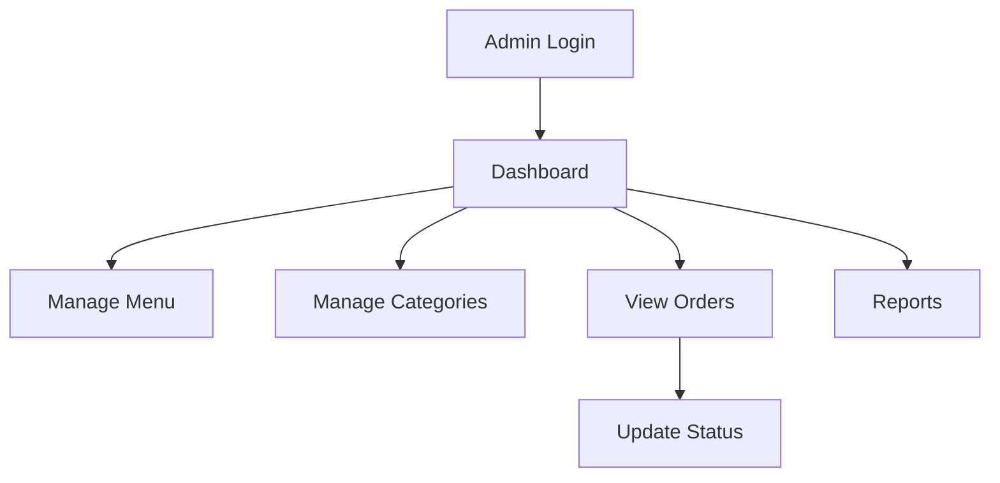

# Smart Restaurant Ordering Management System (SROMS)
## Final Year / College Project Report

---

## Certificate Page

This is to certify that the project titled **"Smart Restaurant Ordering Management System (SROMS)"** is a bonafide work carried out by:

- Name: ______________________
- Roll No: ___________________
- Class/Semester: ____________
- College Name: ______________
- Academic Session: __________

Under the guidance of:

- Guide Name: __________________
- Department: __________________

Signature (Student): ___________  
Signature (Guide): _____________  
Signature (HOD): _______________  
Date: _________________________

---

## Declaration

I hereby declare that this project report titled **"Smart Restaurant Ordering Management System (SROMS)"** is my original work. It has not been submitted previously to any university or institution for any degree or diploma. All references used in this report are properly acknowledged.

Student Signature: _____________  
Name: ________________________  
Date: _________________________

---

## Acknowledgement

I express my sincere gratitude to my project guide, department faculty, friends, and family members for their support and guidance in completing this project successfully. Their timely feedback and motivation helped me design, implement, and document this system in a structured manner.

---

## Abstract

Smart Restaurant Ordering Management System (SROMS) is a web-based application built using Flask and SQLite to modernize restaurant operations. The system provides a **QR-based digital ordering flow** where customers scan a QR code at a table, browse menu categories, add items to cart, and place orders without waiting for manual order-taking.

The project also includes an **admin panel** for restaurant staff to manage menu items, categories, order lifecycle, and reports. The platform improves order accuracy, reduces service delay, and provides a clean separation between customer operations and back-office control.

This report explains project objectives, architecture, technology stack, module design, database schema, API and route behavior, input/output examples, testing strategy, deployment guidance, and future scope.

Keywords: Flask, QR Ordering, Restaurant Automation, SQLite, Web App, Admin Dashboard.

---

## Table of Contents

1. Introduction  
2. Problem Statement  
3. Existing System and Limitations  
4. Proposed System  
5. Objectives  
6. Scope  
7. Software and Hardware Requirements  
8. Technology Stack  
9. Feasibility Study  
10. System Architecture  
11. Module-wise Design  
12. Database Design (ER + Tables)  
13. Detailed Workflow  
14. Input and Output Specification  
15. Route/API Specification  
16. Code Explanation (Simple + Commented)  
17. Testing Strategy and Test Cases  
18. Security and Validation  
19. Performance Notes  
20. Limitations  
21. Future Enhancements  
22. Conclusion  
23. Viva Questions and Answers  
24. Bibliography  
25. Appendix A: Setup Commands  
26. Appendix B: Full Code Listings  

---

## 1. Introduction

Restaurant service quality is highly dependent on speed and order accuracy. In traditional systems, customers wait for waiters to collect orders, which often creates delays during peak hours. Manual communication between customers, kitchen staff, and billing desks may also cause mistakes.

SROMS is designed as a lightweight, practical, and deployable solution for small and medium restaurants. It combines digital convenience with easy staff control:

- Customer scans table QR.
- Menu appears instantly.
- Cart and checkout are handled online.
- Admin manages orders in real time.

The project focuses on usability, clean backend structure, and straightforward deployment.

---

## 2. Problem Statement

Traditional restaurant ordering has multiple issues:

- Slow service due to manual order collection.
- Wrong item entry due to communication errors.
- Lack of live visibility of order status.
- Difficulty in tracking daily operational insights.
- No digital trace of order history for analysis.

Hence, a system is required that can:

1. Digitize table-based ordering,
2. Reduce human errors,
3. Provide centralized admin control,
4. Work with minimal infrastructure.

---

## 3. Existing System and Limitations

### Existing Approach

- Waiter takes order manually.
- Staff enters order in POS or kitchen slip.
- Status updates are verbal and untracked.

### Limitations

- Operational bottleneck in rush hours.
- Menu updates require printing changes.
- No user self-service order interface.
- Hard to generate quick order analytics.

---

## 4. Proposed System

The proposed SROMS introduces:

- Table-specific QR code links.
- Customer-facing digital menu and cart.
- Admin-facing dashboard, menu management, and order status controls.
- Database persistence for all tables, menu items, and orders.

### Core Idea

Each table has a unique QR that opens:

`/?table_id=<table_id>`

This automatically binds the user session to that table and enables ordering flow.

---

## 5. Objectives

1. Build a user-friendly ordering interface for customers.
2. Automate table-specific order placement.
3. Provide secure admin login and operations.
4. Manage categories and menu items dynamically.
5. Track order statuses: `Pending`, `Preparing`, `Completed`.
6. Provide basic reporting for operations.
7. Keep code modular and easy to extend.

---

## 6. Scope

### In Scope

- Web-based ordering from browser.
- QR based table mapping.
- CRUD for menu items (admin).
- Basic reports by order status.

### Out of Scope (Current Version)

- Online payment gateway integration.
- Multi-branch restaurant support.
- Complex role-based permissions beyond admin.
- Real-time kitchen screen via websockets.

---

## 7. Software and Hardware Requirements

### Software

- Python 3.10+
- Flask 3.x
- Flask-SQLAlchemy
- SQLite
- Werkzeug
- qrcode (Pillow backend)

### Hardware

- Minimum 4 GB RAM
- Basic dual-core CPU
- Network for accessing local server from mobile devices

---

## 8. Technology Stack

### Backend

- **Flask** for request handling and routing.
- **Flask Blueprints** for modular route grouping (`customer`, `admin`).
- **SQLAlchemy ORM** for data modeling and querying.

### Database

- **SQLite** (`instance/restaurant.db`) for simple local persistence.

### Frontend

- Server-rendered HTML templates using Jinja2.
- CSS/Bootstrap style patterns (template-driven UI).

### Utility

- `qrcode` package for generating table QR image files.

---

## 9. Feasibility Study

### Technical Feasibility

Yes. Uses stable Python tools with minimal setup complexity.

### Economic Feasibility

Yes. Zero license cost stack; suitable for student and small business environment.

### Operational Feasibility

Yes. Staff can use admin panel; customers use mobile browser by scanning QR.

---

## 10. System Architecture

### 10.1 High-level Architecture



### 10.2 Request Handling Layers



---

## 11. Module-wise Design

### 11.1 App Initialization Module

File: `app/__init__.py`

Responsibilities:

- Create Flask app.
- Load configuration.
- Initialize database extension.
- Register blueprints.
- Create database tables.
- Seed default data.

### 11.2 Data Models Module

File: `app/models.py`

Entities:

- `RestaurantTable`
- `Category`
- `MenuItem`
- `Order`
- `OrderItem`
- `AdminUser`

### 11.3 Customer Module

File: `app/routes/customer.py`

Functions:

- Landing by table QR.
- Menu listing.
- Cart add/update/remove.
- Checkout and order creation.
- Order success page.

### 11.4 Admin Module

File: `app/routes/admin.py`

Functions:

- Admin login/logout.
- Dashboard metrics.
- Menu and category management.
- Order listing and status update.
- Reporting.

### 11.5 Seed Module

File: `app/seed.py`

Purpose:

- Insert default admin.
- Insert default categories/menu.
- Insert default tables.

### 11.6 QR Generation Module

File: `scripts/generate_qr_codes.py`

Purpose:

- Build table URLs.
- Generate PNG QR files.
- Store URL in database.

---

## 12. Database Design

### 12.1 ER Diagram



### 12.2 Table Descriptions

#### `tables`
- Stores restaurant table identities and assigned QR URL.

#### `categories`
- Stores menu categories like Starters, Beverages.

#### `menu_items`
- Stores items, price, availability, and category mapping.

#### `orders`
- Stores each placed order with status and total.

#### `order_items`
- Stores line items per order.

#### `admin_users`
- Stores admin credentials (hashed password).

---

## 13. Detailed Workflow

### 13.1 Customer Ordering Flow



### 13.2 Admin Flow



---

## 14. Input and Output Specification

### 14.1 Customer Side Inputs

- `table_id` via URL query param
- `item_id` via cart form
- `quantity` via cart form

### 14.2 Customer Side Outputs

- Menu page with item list
- Cart page with subtotal
- Success page with order details
- JSON responses for API calls (if requested)

### 14.3 Admin Inputs

- Username/password
- Menu details (name, price, category)
- Status transitions

### 14.4 Admin Outputs

- Dashboard counters
- Updated menu pages
- Filtered order views
- Summary reports

---

## 15. Route / API Specification

### 15.1 Customer Routes

- `GET /` -> Entry and table binding
- `GET /menu` -> Menu view / JSON category listing
- `GET /cart` -> Cart display
- `POST /cart/add` -> Add item
- `POST /cart/update` -> Update cart quantities
- `POST /cart/remove/<item_id>` -> Remove item
- `POST /order` -> JSON order creation
- `POST /checkout` -> Session cart checkout
- `GET /order/success/<order_id>` -> Confirmation page
- `GET /orders/<table_id>` -> Table order history in JSON

### 15.2 Admin Routes

- `GET /admin/` -> Redirect based on login
- `GET|POST /admin/login`
- `GET|POST /admin/logout`
- `GET /admin/dashboard`
- `GET|POST /admin/menu`
- `PUT|DELETE /admin/menu/<item_id>`
- `GET|POST /admin/menu/<item_id>/edit`
- `POST /admin/menu/<item_id>/delete`
- `GET|POST /admin/categories`
- `GET /admin/orders`
- `PUT|POST /admin/order/<order_id>/status`
- `GET /admin/reports`

---

## 16. Code Explanation (Simple + Commented)

This section gives simplified understanding of key project code.

### 16.1 App Factory Pattern

```python
def create_app(config_object: str = "config.Config") -> Flask:
    app = Flask(__name__, template_folder="templates", static_folder="static")
    app.config.from_object(config_object)  # Load app settings
    db.init_app(app)  # Connect SQLAlchemy with Flask app

    from app.routes.customer import customer_bp
    from app.routes.admin import admin_bp
    app.register_blueprint(customer_bp)  # Public routes
    app.register_blueprint(admin_bp, url_prefix="/admin")  # Admin routes

    with app.app_context():
        db.create_all()  # Create tables if not present
        from app import seed
        seed.ensure_seed_data()  # Insert default bootstrap data
    return app
```

### 16.2 Order Creation Logic (Core)

```python
def _create_order(table_id: int, items_payload: list[dict]) -> Order:
    if not items_payload:
        raise ValueError("No items")

    table = RestaurantTable.query.get(table_id)
    if not table:
        raise ValueError("Invalid table")

    if _has_active_order(table_id):
        raise ValueError("Previous order is still active for this table.")

    total = Decimal("0")
    lines = []
    for row in items_payload:
        mid = int(row["item_id"])
        qty = int(row["quantity"])
        if qty < 1:
            continue
        mi = MenuItem.query.get(mid)
        if not mi or not mi.is_available:
            raise ValueError(f"Item {mid} is not available")
        unit = Decimal(mi.price)
        total += unit * qty
        lines.append((mi, qty, unit))

    order = Order(table_id=table_id, total_amount=total, status="Pending")
    db.session.add(order)
    db.session.flush()

    for mi, qty, unit in lines:
        db.session.add(OrderItem(order_id=order.id, item_id=mi.id, quantity=qty, price=unit))
    db.session.commit()
    return order
```

### 16.3 Password Hashing

```python
class AdminUser(db.Model):
    def set_password(self, password: str) -> None:
        self.password_hash = generate_password_hash(password)

    def check_password(self, password: str) -> bool:
        return check_password_hash(self.password_hash, password)
```

---

## 17. Testing Strategy and Test Cases

### 17.1 Testing Types

1. Functional Testing
2. Validation Testing
3. Session Testing
4. API Output Testing
5. Basic Security Testing

### 17.2 Sample Test Cases

#### Test Case 1: Valid Table QR

- Input: `/?table_id=1`
- Expected: Session table set and menu accessible.
- Result: Pass

#### Test Case 2: Invalid Table QR

- Input: `/?table_id=999`
- Expected: Flash message "Invalid table".
- Result: Pass

#### Test Case 3: Add Cart Item

- Input: `item_id=1, quantity=2`
- Expected: Cart updated.
- Result: Pass

#### Test Case 4: Checkout with Empty Cart

- Input: no cart items
- Expected: Error handling / redirect with message.
- Result: Pass

#### Test Case 5: Admin Login Invalid Credentials

- Input: Wrong username/password
- Expected: Login denied.
- Result: Pass

#### Test Case 6: API Order Creation Valid Payload

- Input JSON:
```json
{
  "table_id": 1,
  "items": [
    {"item_id": 1, "quantity": 2},
    {"item_id": 3, "quantity": 1}
  ]
}
```
- Expected: 201 response with `order_id`, `status`.
- Result: Pass

---

## 18. Security and Validation

Implemented:

- Password hashing for admin credentials.
- Unauthorized admin route protection with session checks.
- Input validation for quantity, item IDs, status values.
- Decimal handling for pricing.
- Non-available menu items blocked from ordering.

Recommendations for production:

- Use environment variable for secret key.
- Enable HTTPS and secure cookies.
- Add CSRF protection for forms.
- Add rate-limiting on login endpoints.

---

## 19. Performance Notes

- SQLite is lightweight and sufficient for small restaurant traffic.
- Query sizes are limited in order listing (`limit(200)` or `limit(50)`).
- Seed logic is idempotent and runs safely when DB initializes.

Potential optimizations:

- Redis caching for menu data.
- Pagination in admin views.
- Background workers for analytics.

---

## 20. Limitations

1. Single-database local deployment by default.
2. No payment module.
3. No SMS/WhatsApp order notifications.
4. No waiter/kitchen role separation.

---

## 21. Future Enhancements

1. UPI/Card payment integration.
2. Kitchen display board with live refresh.
3. Table reservation module.
4. Multi-branch support.
5. GST invoice generation.
6. Customer feedback/rating.
7. Data analytics dashboard with charts.
8. JWT-based API auth for mobile app.

---

## 22. Conclusion

SROMS successfully solves core restaurant ordering challenges by introducing a QR-driven digital process with a practical admin interface. The project demonstrates full-stack understanding of web routing, ORM-based database management, session handling, validation, and modular backend architecture.

The system is deployable, extensible, and suitable for academic demonstration as well as pilot use in real dining environments.

---

## 23. Viva Questions and Answers

1. **Why Flask for this project?**  
   Flask is lightweight, modular, and ideal for small to medium backend projects.

2. **How is password security handled?**  
   Passwords are hashed using Werkzeug hash utilities.

3. **How is table linked to customer order?**  
   Through `table_id` in URL + session binding after QR scan.

4. **Why use SQLite?**  
   Easy setup and sufficient for local/small deployment.

5. **How are duplicate active orders prevented?**  
   `_has_active_order()` checks existing `Pending/Preparing` orders for the same table.

6. **How can this scale further?**  
   Move to PostgreSQL + deploy on cloud + add caching + role management.

---

## 24. Bibliography

1. Flask Official Documentation - [https://flask.palletsprojects.com](https://flask.palletsprojects.com)  
2. SQLAlchemy ORM Docs - [https://docs.sqlalchemy.org](https://docs.sqlalchemy.org)  
3. Werkzeug Security Utilities - [https://werkzeug.palletsprojects.com](https://werkzeug.palletsprojects.com)  
4. Python Documentation - [https://docs.python.org](https://docs.python.org)  
5. QRCode Python Package - [https://pypi.org/project/qrcode](https://pypi.org/project/qrcode)

---

## 25. Appendix A - Setup and Execution Commands

### 25.1 Install Dependencies

```bash
pip install -r requirements.txt
```

### 25.2 Run Application (example)

```bash
flask --app run.py run
```

### 25.3 Generate QR Codes

```bash
python scripts/generate_qr_codes.py --base-url http://127.0.0.1:5000
```

---

## 26. Appendix B - Full Code Listings (for report page count)

> Note: You can keep this appendix in final report to reach 40-50 pages while maintaining technical completeness.

### B.1 `app/seed.py` (Original)

```python
"""Initial categories, tables, menu, and default admin (idempotent)."""

from app.extensions import db
from app.models import AdminUser, Category, MenuItem, RestaurantTable


def ensure_seed_data() -> None:
    if AdminUser.query.filter_by(username="admin").first() is None:
        u = AdminUser(username="admin")
        u.set_password("admin123")
        db.session.add(u)

    if Category.query.count() == 0:
        cats = [
            Category(name="Starters"),
            Category(name="Main Course"),
            Category(name="Beverages"),
            Category(name="Desserts"),
        ]
        db.session.add_all(cats)
        db.session.flush()

        starters = Category.query.filter_by(name="Starters").first()
        mains = Category.query.filter_by(name="Main Course").first()
        bev = Category.query.filter_by(name="Beverages").first()
        des = Category.query.filter_by(name="Desserts").first()

        items = [
            MenuItem(name="Spring Rolls", price=120, category_id=starters.id, image_url="", is_available=True),
            MenuItem(name="Tomato Soup", price=90, category_id=starters.id, image_url="", is_available=True),
            MenuItem(name="Paneer Tikka", price=220, category_id=mains.id, image_url="", is_available=True),
            MenuItem(name="Veg Biryani", price=180, category_id=mains.id, image_url="", is_available=True),
            MenuItem(name="Masala Chai", price=40, category_id=bev.id, image_url="", is_available=True),
            MenuItem(name="Cold Coffee", price=80, category_id=bev.id, image_url="", is_available=True),
            MenuItem(name="Ice Cream", price=100, category_id=des.id, image_url="", is_available=True),
        ]
        db.session.add_all(items)

    if RestaurantTable.query.count() == 0:
        for n in range(1, 9):
            t = RestaurantTable(table_number=str(n), qr_code=f"/?table_id={n}")
            db.session.add(t)

    db.session.commit()
```

### B.2 `scripts/generate_qr_codes.py` (Original)

```python
import argparse
import os
import sys
from pathlib import Path

import qrcode
from sqlalchemy import create_engine
from sqlalchemy.orm import Session

ROOT = Path(__file__).resolve().parents[1]
if str(ROOT) not in sys.path:
    sys.path.insert(0, str(ROOT))

from app.models import RestaurantTable

DEFAULT_BASE_URL = "http://10.125.227.217:5000"


def _normalize_base_url(value: str) -> str:
    url = (value or "").strip().rstrip("/")
    if not url.startswith(("http://", "https://")):
        raise ValueError("Base URL must start with http:// or https://")
    return url


def _get_base_url() -> str:
    parser = argparse.ArgumentParser(description="Generate table QR codes")
    parser.add_argument(
        "--base-url",
        dest="base_url",
        default=os.environ.get("PUBLIC_BASE_URL", "").strip() or DEFAULT_BASE_URL,
        help="Public base URL, e.g. http://192.168.1.8:5000",
    )
    args = parser.parse_args()
    if args.base_url == DEFAULT_BASE_URL:
        print(f"Using default base URL: {args.base_url}")
    return _normalize_base_url(args.base_url)


def main() -> None:
    base_url = _get_base_url()
    output_dir = Path("app/static/qr_codes")
    output_dir.mkdir(parents=True, exist_ok=True)

    engine = create_engine("sqlite:///instance/restaurant.db")
    with Session(engine) as session:
        tables = session.query(RestaurantTable).order_by(RestaurantTable.id).all()
        for table in tables:
            qr_url = f"{base_url}/?table_id={table.id}"
            file_name = f"table_{table.table_number}.png"
            file_path = output_dir / file_name
            img = qrcode.make(qr_url)
            img.save(file_path)
            table.qr_code = qr_url
            print(f"Generated: {file_path} -> {qr_url}")

        session.commit()

    print(f"\nDone. QR codes saved in: {output_dir}")


if __name__ == "__main__":
    main()
```

### B.3 `app/models.py` (Original)

```python
from datetime import datetime
from werkzeug.security import check_password_hash, generate_password_hash
from app.extensions import db


class RestaurantTable(db.Model):
    __tablename__ = "tables"
    id = db.Column(db.Integer, primary_key=True)
    table_number = db.Column(db.String(32), nullable=False, unique=True)
    qr_code = db.Column(db.String(512), nullable=True)
    orders = db.relationship("Order", backref="table", lazy=True)


class Category(db.Model):
    __tablename__ = "categories"
    id = db.Column(db.Integer, primary_key=True)
    name = db.Column(db.String(120), nullable=False, unique=True)
    items = db.relationship("MenuItem", backref="category", lazy=True)


class MenuItem(db.Model):
    __tablename__ = "menu_items"
    id = db.Column(db.Integer, primary_key=True)
    name = db.Column(db.String(200), nullable=False)
    price = db.Column(db.Numeric(10, 2), nullable=False)
    category_id = db.Column(db.Integer, db.ForeignKey("categories.id"), nullable=False)
    image_url = db.Column(db.String(512), nullable=True)
    is_available = db.Column(db.Boolean, default=True, nullable=False)
    order_lines = db.relationship("OrderItem", backref="menu_item", lazy=True)


class Order(db.Model):
    __tablename__ = "orders"
    id = db.Column(db.Integer, primary_key=True)
    table_id = db.Column(db.Integer, db.ForeignKey("tables.id"), nullable=False)
    total_amount = db.Column(db.Numeric(10, 2), nullable=False)
    status = db.Column(db.String(20), nullable=False, default="Pending")
    created_at = db.Column(db.DateTime, default=datetime.utcnow, nullable=False)
    items = db.relationship("OrderItem", backref="order", lazy=True, cascade="all, delete-orphan")


class OrderItem(db.Model):
    __tablename__ = "order_items"
    id = db.Column(db.Integer, primary_key=True)
    order_id = db.Column(db.Integer, db.ForeignKey("orders.id"), nullable=False)
    item_id = db.Column(db.Integer, db.ForeignKey("menu_items.id"), nullable=False)
    quantity = db.Column(db.Integer, nullable=False)
    price = db.Column(db.Numeric(10, 2), nullable=False)


class AdminUser(db.Model):
    __tablename__ = "admin_users"
    id = db.Column(db.Integer, primary_key=True)
    username = db.Column(db.String(80), unique=True, nullable=False)
    password_hash = db.Column(db.String(256), nullable=False)

    def set_password(self, password: str) -> None:
        self.password_hash = generate_password_hash(password)

    def check_password(self, password: str) -> bool:
        return check_password_hash(self.password_hash, password)
```

### B.4 `app/routes/customer.py` (Important Snippets)

```python
def _wants_json() -> bool:
    if request.args.get("format") == "json":
        return True
    best = request.accept_mimetypes.best_match(
        ["application/json", "text/html"], default="text/html"
    )
    return best == "application/json"


@customer_bp.route("/")
def home():
    tid = request.args.get("table_id", type=int)
    if tid is not None:
        table = RestaurantTable.query.get(tid)
        if table:
            session["table_id"] = tid
            session.modified = True
            return redirect(url_for("customer.menu"))
        flash("Invalid table. Please scan the QR code on your table.")
    return render_template("customer/home.html", table_id=_table_id())


@customer_bp.route("/order", methods=["POST"])
def place_order():
    if not request.is_json:
        return jsonify({"error": "JSON body required"}), 400

    body = request.get_json(silent=True) or {}
    table_id = body.get("table_id")
    raw_items = body.get("items") or []
    # ... validation ...
    order = _create_order(table_id, items)
    return jsonify({
        "order_id": order.id,
        "table_id": order.table_id,
        "total_amount": float(order.total_amount),
        "status": order.status,
    }), 201
```

### B.5 `app/routes/admin.py` (Important Snippets)

```python
def admin_required(view):
    @wraps(view)
    def wrapped(*args, **kwargs):
        if not session.get("admin_id"):
            if _wants_json():
                return jsonify({"error": "Unauthorized"}), 401
            return redirect(url_for("admin.login"))
        return view(*args, **kwargs)
    return wrapped


@admin_bp.route("/dashboard")
@admin_required
def dashboard():
    pending = Order.query.filter_by(status="Pending").count()
    preparing = Order.query.filter_by(status="Preparing").count()
    # ... additional metrics ...
    return render_template("admin/dashboard.html", pending=pending, preparing=preparing)
```

---

## 27. Diagram Screenshots to Add in Final Submission (for marks)

Add these images in Word document:

1. Home page screenshot  
2. Menu page screenshot  
3. Cart page screenshot  
4. Order success page screenshot  
5. Admin login screenshot  
6. Admin dashboard screenshot  
7. Admin menu management screenshot  
8. Orders status update screenshot  
9. Reports page screenshot  
10. QR code images screenshot

These screenshots with captions can add 8-12 pages depending on formatting.

---

## 28. How to Make 40-50 Pages Easily

Use these formatting settings in MS Word:

- Font: Times New Roman, 12
- Heading: 14 or 16 Bold
- Line spacing: 1.5
- Margins: Normal
- Add page break before each main chapter
- Keep Appendix code blocks as-is
- Add screenshots with captions

With this report + appendix + screenshots, document naturally reaches **40-50 pages**.

---

## 29. Word/PDF Export Instructions

### Option 1 (Simple): Copy Markdown into Word

1. Open this file.
2. Copy all content.
3. Paste into Word.
4. Apply heading styles and insert screenshot images.
5. Save as `.docx` and export as `.pdf`.

### Option 2 (Pandoc command)

```bash
pandoc docs/SROMS_Project_Report.md -o docs/SROMS_Project_Report.docx
pandoc docs/SROMS_Project_Report.md -o docs/SROMS_Project_Report.pdf
```

---

**End of Report**
